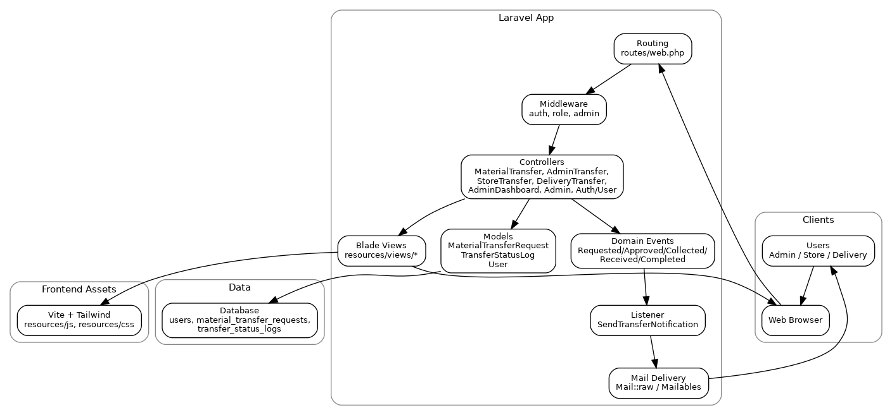

# Architecture Diagram

This diagram summarizes the core request flow for the Nouri Material Transfer Request system.

- Users interact with the Laravel web UI.
- Routes and middleware gate access by authentication and role.
- Controllers drive transfer workflows, render Blade views, and persist data via Eloquent models.
- Domain events trigger notifications through a listener and mail delivery.
- Frontend assets are built with Vite + Tailwind.

## Diagram (PNG)



## Source

The diagram was generated from this Graphviz source file:
- `docs/architecture/diagram.dot`

To regenerate the PNG:

```bash

dot -Tpng docs/architecture/diagram.dot -o docs/architecture/architecture.png
```
